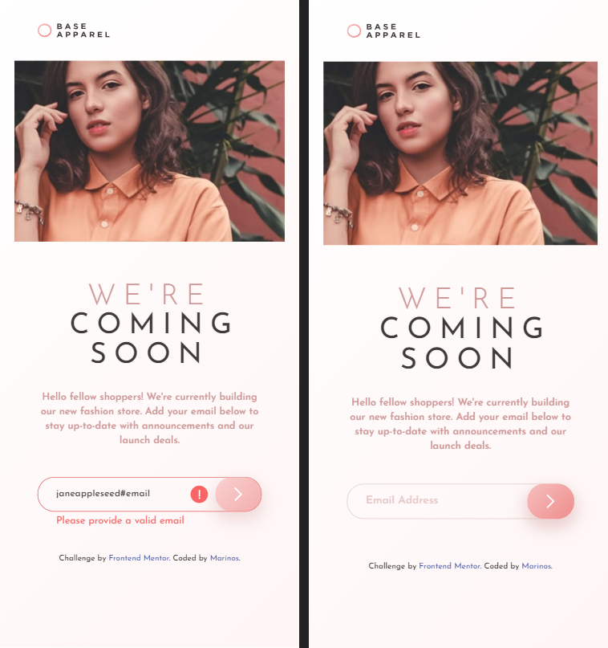
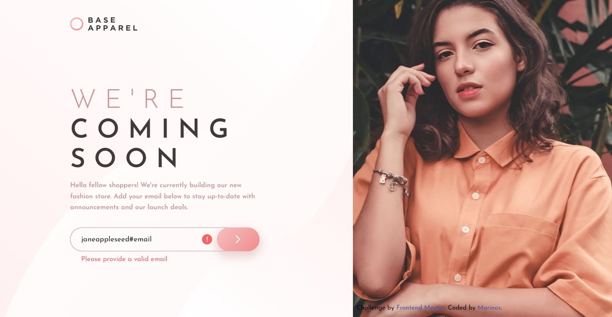

# Frontend Mentor - Base Apparel coming soon page solution

This is a solution to the [Base Apparel coming soon page challenge on Frontend Mentor](https://www.frontendmentor.io/challenges/base-apparel-coming-soon-page-5d46b47f8db8a7063f9331a0). Frontend Mentor challenges help you improve your coding skills by building realistic projects. 

## Table of contents

- [Overview](#overview)
  - [The challenge](#the-challenge)
  - [Screenshot](#screenshot)
  - [Links](#links)
- [My process](#my-process)
  - [Built with](#built-with)
  - [Useful resources](#useful-resources)

## Overview

### The challenge

Users should be able to:

- View the optimal layout for the site depending on their device's screen size
- See hover states for all interactive elements on the page
- Receive an error message when the `form` is submitted if:
  - The `input` field is empty
  - The email address is not formatted correctly

### Screenshot of my solution

### Links

- Live demo of my solution: [Click Here!](https://marinvcq.github.io/base-apparel-coming-soon/)

## My process

### Built with

- Semantic HTML5 markup
- CSS custom properties
- Flexbox
- Vanilla JS
- Mobile-first workflow

### Useful resources

- [JS validate input newbie tuto](https://linuxhint.com/email-validation-javascript/) - About email validation in Javascript with simple examples.

## Front-end Style Guide

### Layout

The designs were created to the following widths:

- Mobile: 375px
- Desktop: 1440px

### Colors

#### Primary

- Desaturated Red: hsl(0, 36%, 70%)
- Soft Red: hsl(0, 93%, 68%)

#### Neutral

- Dark Grayish Red: hsl(0, 6%, 24%)

#### Gradients

- Linear, 135deg, from hsl(0, 0%, 100%), to hsl(0, 100%, 98%)
- Linear, 135deg, from hsl(0, 80%, 86%), to hsl(0, 74%, 74%)

### Typography

#### Body Copy

- Font size: 16px

#### Font

- Family: [Josefin Sans](https://fonts.google.com/specimen/Josefin+Sans)
- Weights: 300, 400, 600
